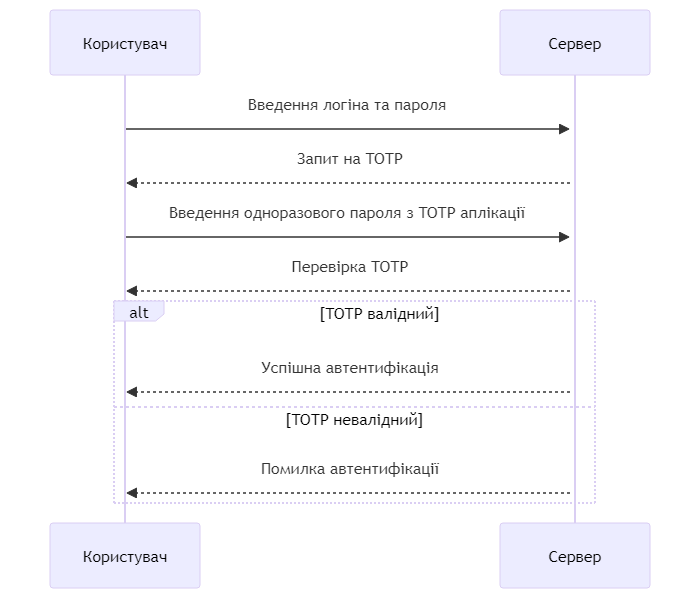

# Bachelor TOTP Auth
Repository contains code of TOTP Authentication for my Dyplom Bakalavra (Diploma/ qualification of Bachelor)

|             | Information                         | 
| --------    | --------                            |
| Name        | TOTP Authentication                 |
| Standard    | RFC 6238                            |
| Description | One time passwords (OTPs) are commonly used as confirmation for authentication. OTPs are randomly generated codes that can be used to verify if the user is who they claim to be. Its often used after user credentials are verified for apps that leverage two-factor authentication.  |

#### Diagram:
